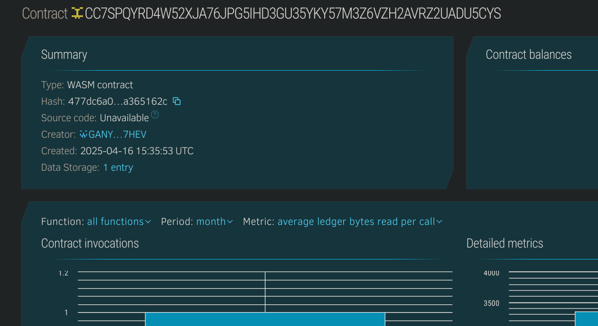

# 🏠 Property History Ledger

## 📝 Project Description
The Property History Ledger is a decentralized smart contract that allows users to register properties and track ownership history immutably. Each property includes its unique ID, current owner, and a historical ledger of past ownership changes with remarks and timestamps.

## 🌍 Project Vision
To digitize and secure the entire lifecycle of property ownership using blockchain. The goal is to ensure transparent, tamper-proof property records accessible to all stakeholders.

## ✨ Key Features
- 🆔 Unique registration for every new property.
- 🔁 Transparent transfer of ownership with remark and timestamp logging.
- 🧾 On-chain ownership history for audit and legal purposes.
- 🛡️ Immutable and secure ledger of property data.

## 🔮 Future Scope
- 🏢 Integration with government land record systems.
- 🌐 Web dashboard for property lookup and transfer requests.
- 🧑‍💼 Role-based access for legal, banking, and municipal bodies.
- 🪙 Payment integration for transfer fees using stablecoins or native tokens.

## 🛠️ Built With
- [Soroban SDK](https://soroban.stellar.org)
- Stellar Blockchain
- Rust (Smart Contract)

## Contract Details
CC7SPQYRD4W52XJA76JPG5IHD3GU35YKY57M3Z6VZH2AVRZ2UADU5CYS

